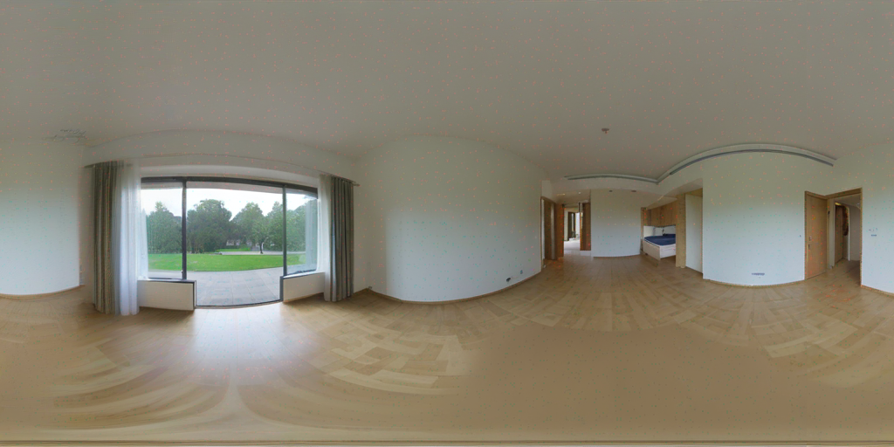
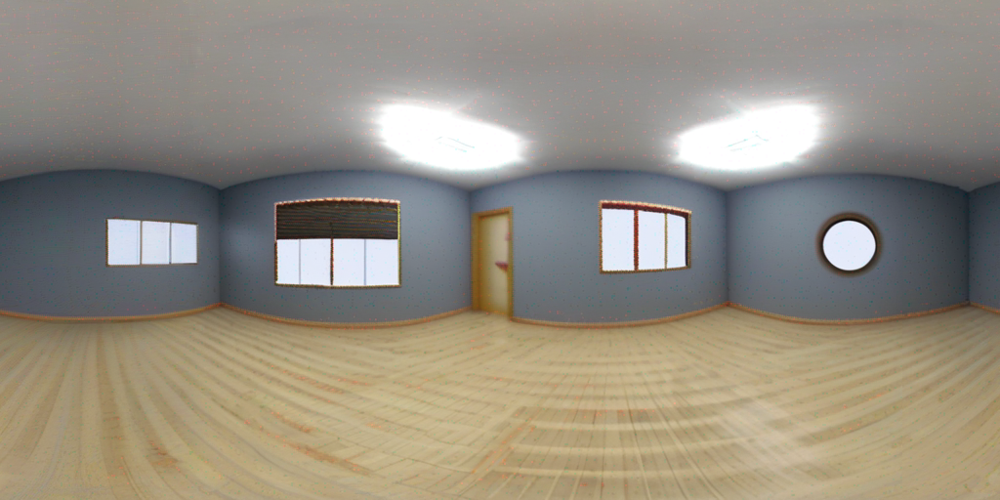

# 360° Panorama using Stable Diffusion

The project generates a coherent and seam tiled panorama given a text prompt and optionally a depth image.

The goal is to meet the following criteria

1. The scene should look consistent as per the user’s prompt
2. The generated panorama’s ends should meet i.e. seam needs to be tiled.

Generated panorama without depth conditioning


Generated panorama with depth conditioning



## Setup

```
name: panorama
channels:
  - defaults
dependencies:
  - python=3.9
  - torchaudio
  - torchvision
  - pytorch
  - pytorch-cuda
  - diffusers
  - jupyter
  - jupyterlab
prefix: <>/miniconda3/envs/panorama
```

```
conda activate panorama
pip install transformers diffusers
```

## Generating images

Use the notebook demo.ipynb to generate and visualize a panorama conditioned on the textual prompt

Pre-generated and their corresponding prompts are at images/ and prompts.txt respectively

## Thought Process

1. Generating a hdri view image from a pre-trained checkpoint was straightforward. Used the model from [https://huggingface.co/jbilcke-hf/sdxl-panorama](https://huggingface.co/jbilcke-hf/sdxl-panorama) and used [MagicPrompt](https://huggingface.co/spaces/Gustavosta/MagicPrompt-Stable-Diffusion) to get a sense of what the prompts should contain.
2.
3. While the output of 1. were realistic generations (in most cases), they were still not a 360° panorama because the ends of the image weren't coherent. I adopted a very simple of approach of masking the ends of the image, shiting the image by an offset and using SD to inpaint the masked portion of the image. This ensured that the ends of the panorama were consistent. The inpainting is done using guiding_scale=1 so that the prompt is ignored completely.

I experimented with tweaking the prompt quite a bit to try and avoid doing step 2. but the prompting was just not enough. The ends of the image would always be mismatched. The inpainting approach seemed like the most straightforward approach from that point on.

## Analysis of failure cases + thoughts for improvement

### Failure cases

1. Images generated without conditioning on the depth map resulted in pretty good images and were true to the prompt description (for the most part). Although when I added details like with a cat, the cat was never generated in the image. Viewing the generated images on the 360° Panorama Viewer gave non standard views (some walls were bigger than others, closer than others etc.)

2. Adding the depth conditioning resulted in much more uniform views on 360° Panorama Viewer. But all detail in the prompts was lost, and weird artifacts inconsistent with the prompts were introduced. Perhaps the depth conditioning should have been done on an input mix of (prompt, generated image without depth, depth map) to morph the generated image with depth information.

### Thoughts for improvement

1. The depth map corresponds to a very particular generation style (a room with 4 walls). If the goal is to always generate such images, perhaps the panorama generator (sdxl-panorama) should be finetuned with relevant data (few shot finetuning)

2. While only tweaking the positive prompts with additional criteria might make things better, it's a very flaky solution (I found this even in my experimentation)

3. Using negative prompts effectively is another area that would improve generations.

